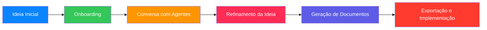

# 🚀 IdeaForge

<div align="center">
  
  
  <p><em>Transforme ideias em projetos estruturados com a ajuda de especialistas de IA</em></p>
  
  [](LICENSE)
  [](https://reactjs.org/)
  [](https://firebase.google.com/)
  [](https://www.typescriptlang.org/)
  [](https://vitejs.dev/)
</div>

## 🌟 Visão Geral

**IdeaForge** é uma plataforma revolucionária para empreendedores e criativos que transforma ideias vagas em projetos estruturados com documentos acionáveis. Utilizando IA especializada, o IdeaForge oferece feedback de múltiplas perspectivas para refinar sua ideia e gerar documentos essenciais como pitch decks, business canvas e landing pages.

<div align="center">
  <table>
    <tr>
      <td align="center" width="33%">
        
        <br />
        <b>Validação de Ideias</b>
      </td>
      <td align="center" width="33%">
        
        <br />
        <b>Estratégia de Negócios</b>
      </td>
      <td align="center" width="33%">
        
        <br />
        <b>Documentos Acionáveis</b>
      </td>
    </tr>
  </table>
</div>

## ✨ Recursos Principais

### 🧠 Agentes Especialistas de IA

<details>
<summary><b>Clique para expandir e conhecer nossos especialistas</b></summary>

<table>
  <tr>
    <td width="20%" align="center">
      
      <br />
      <b>Valida IA</b>
    </td>
    <td width="80%">
      Analisa a viabilidade da sua ideia, identifica concorrentes e avalia o potencial de mercado com dados e insights objetivos.
    </td>
  </tr>
  <tr>
    <td width="20%" align="center">
      
      <br />
      <b>Strategos AI</b>
    </td>
    <td width="80%">
      Desenvolve modelos de negócio, estratégias de monetização e planos de crescimento adaptados ao seu projeto.
    </td>
  </tr>
  <tr>
    <td width="20%" align="center">
      
      <br />
      <b>Pixel AI</b>
    </td>
    <td width="80%">
      Cria conceitos de identidade visual, branding e experiência do usuário para dar vida à sua ideia.
    </td>
  </tr>
  <tr>
    <td width="20%" align="center">
      
      <br />
      <b>Impulso AI</b>
    </td>
    <td width="80%">
      Desenvolve estratégias de marketing, personas, naming e mensagens-chave para conectar sua ideia ao público certo.
    </td>
  </tr>
  <tr>
    <td width="20%" align="center">
      
      <br />
      <b>Construtor AI</b>
    </td>
    <td width="80%">
      Traduz sua ideia em planos de implementação prática, definindo MVP, recursos necessários e cronogramas.
    </td>
  </tr>
</table>
</details>

### 📄 Documentos Acionáveis

<div align="center">
  
</div>

- **Pitch Deck** - Apresentações profissionais para investidores e parceiros
- **Business Canvas** - Visualização estruturada do seu modelo de negócio
- **Landing Page** - Conteúdo otimizado para conversão
- **Plano de Marketing** - Estratégias para alcançar seu público-alvo
- **Análise de Viabilidade** - Avaliação objetiva do potencial da sua ideia

### 🔄 Fluxo de Trabalho Intuitivo



## 🛠️ Tecnologias

- **Frontend:** React, TypeScript, Vite
- **Backend:** Firebase (Auth, Realtime Database)
- **IA:** Google Generative AI (Gemini)
- **Estilo:** Modo escuro com UI moderna e minimalista
- **Fontes:** Bitter (títulos) e Exo (textos)

## 🚀 Começando

### Pré-requisitos

- Node.js 18+
- Conta no Firebase
- Chave de API do Google AI Studio

### Instalação

```bash
# Clone o repositório
git clone https://github.com/seu-usuario/ideaforge.git
cd ideaforge

# Instale as dependências
npm install

# Configure as variáveis de ambiente
cp .env.example .env
# Edite o arquivo .env com suas credenciais

# Inicie o servidor de desenvolvimento
npm run dev
```

## 📱 Demonstração

<div align="center">
  <table>
    <tr>
      <td align="center">
        
        <br />
        <b>Dashboard</b>
      </td>
      <td align="center">
        
        <br />
        <b>Chat com Agentes</b>
      </td>
      <td align="center">
        
        <br />
        <b>Documentos</b>
      </td>
    </tr>
  </table>
</div>

## 🔮 Roadmap

- [ ] Integração com ferramentas de design (Figma, Canva)
- [ ] Exportação direta para plataformas de apresentação
- [ ] Colaboração em tempo real para equipes
- [ ] Marketplace de templates para documentos
- [ ] Análise de sentimento e feedback do público

## 🤝 Contribuindo

Contribuições são bem-vindas! Veja [CONTRIBUTING.md](CONTRIBUTING.md) para mais detalhes.

<details>
<summary><b>Guia de Contribuição Rápido</b></summary>

1. Faça um fork do projeto
2. Crie sua branch de feature (`git checkout -b feature/AmazingFeature`)
3. Commit suas mudanças (`git commit -m 'Add some AmazingFeature'`)
4. Push para a branch (`git push origin feature/AmazingFeature`)
5. Abra um Pull Request

</details>

## 📜 Licença

Este projeto está licenciado sob a Licença MIT - veja o arquivo [LICENSE](LICENSE) para detalhes.

## 🙏 Agradecimentos

- [Google AI Studio](https://ai.google.dev/) por fornecer a API Gemini
- [Firebase](https://firebase.google.com/) pela infraestrutura de backend
- [React](https://reactjs.org/) e [Vite](https://vitejs.dev/) pelo framework frontend
- Todos os empreendedores e criativos que inspiraram este projeto

---

<div align="center">
  <p>
    <a href="https://github.com/seu-usuario/ideaforge/issues">Reportar Bug</a> •
    <a href="https://github.com/seu-usuario/ideaforge/issues">Solicitar Feature</a>
  </p>
  
  <p>Feito com ❤️ para empreendedores e criativos</p>
  
  <a href="https://github.com/seu-usuario">
    
  </a>
</div>
